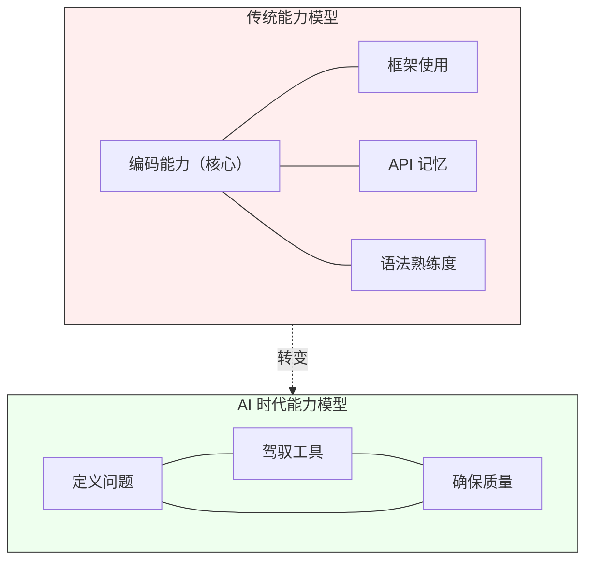
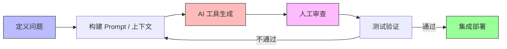

+++
date = '2026-09-15T16:07:20+08:00'
draft = false
title = 'AI编程时代：开发者的核心能力正在重新定义'
slug = 'ai-era-developer-core-skills-redefined'
description = '当 AI 能够高效生成代码时，开发者的价值不再取决于写代码的速度。本文剖析开发者核心能力的迁移方向：从编码执行转向问题定义、工具驾驭和质量保障三大支柱，并探讨这一转变对团队建设的启示。'
categories = ['软件工程']
tags = ['AI编程', '软件工程', '团队管理']
+++

过去两年，AI 代码生成工具的能力边界几乎每个月都在扩张：从补全一行循环，到生成整个函数，再到根据自然语言描述搭建模块骨架。对开发者来说，这不再是一个"未来会发生"的趋势，而是每天都在改变工作方式的现实。当写代码这件事的边际成本快速趋近于零时，一个绕不开的问题浮出水面：开发者的核心竞争力到底是什么？

答案正在从"写出代码"转向另外三件事——定义问题、驾驭工具、确保质量。

## "写代码"正在从核心能力变成基础能力

回顾软件行业的发展，编码能力长期是开发者最重要的硬通货。面试考算法题、晋升看技术深度、日常比拼谁写得快写得巧——整个评价体系都围绕"编码执行"展开。这不是没有道理：在 AI 工具成熟之前，从需求到可运行代码之间的鸿沟，确实需要扎实的编码能力来跨越。

但这条等式正在失效。AI 工具已经能高质量地完成大量编码工作——写 CRUD、生成样板代码、实现常见算法、甚至按照测试用例补全业务逻辑。这些过去需要初级到中级开发者花费数小时的工作，现在几分钟就能拿到一个可用的初稿。

需要做一个关键区分：**编码执行不等于工程能力**。编码执行是把明确的规格说明翻译成代码；工程能力还包括判断该写什么、怎么组织、写完对不对。AI 自动化的是前者，后者仍然完全依赖人。把这两者混为一谈，是许多焦虑的来源，也是误判的起点。

## 新能力模型：三根支柱

旧的开发者能力模型是一座单峰——编码能力是顶点，其他能力围绕它展开。新的能力模型更像一座三柱结构：定义问题、驾驭工具、确保质量，三者共同支撑起一个开发者在 AI 时代的价值。

### 支柱一：定义问题

AI 最擅长的是"给一个明确的问题，生成一个合理的解答"。但现实中的软件工程问题，很少以明确的形态出现。

定义问题的能力包括：把模糊的业务诉求翻译成精确的技术问题；识别出约束条件、边界情况和隐含假设；判断哪些问题值得用代码解决，哪些问题应该用流程或沟通解决。这些工作的本质是**在不确定性中建立确定性**——AI 能写代码，但"该写哪段代码"这个判断，目前仍然是人的工作。

举个常见的例子：业务方说"系统太慢了，优化一下"。编码执行层面的反应是去看 SQL 慢查询、加缓存、优化算法。而定义问题层面的工作是先搞清楚：慢在哪里、谁觉得慢、慢到什么程度不可接受、是最近才慢还是一直慢、瓶颈在应用层还是网络层。问题定义清楚了，解法往往自己就浮现了；问题没定义清楚就开始写代码，大概率是在错误的方向上越跑越远。

### 支柱二：驾驭工具

AI 工具不是即插即用的——同一个工具在不同人手里，产出质量差异巨大。差距不在工具本身，而在使用者的驾驭能力。

驾驭工具包含三个层次：

- **选择与编排**：面对不同的任务（生成新代码、重构旧代码、写测试、查 bug），选择合适的工具和策略。有时需要给 AI 完整的上下文，有时只需要一段精确的 prompt；有时让它一步到位，有时拆成小步迭代效果更好。
- **理解边界**：知道 AI 擅长什么、不擅长什么。它擅长模式匹配和样板生成，不擅长理解业务潜规则、判断架构取舍、处理跨系统的隐式依赖。把对的任务交给对的工具，是效率最大化的关键。
- **融入工作流**：AI 不是工作流之外的"魔法黑盒"，而是需要被嵌入到开发、审查、测试、部署的链条中，成为流水线的一个环节。这要求开发者重新设计自己的工作流程，而不是在旧流程上"加一个 AI 按钮"。

这张图的关键信息是：AI 生成只是链条中的一环，而不是全部。链条两端的"定义问题"和"审查验证"，恰恰是最需要人类判断力的地方。

### 支柱三：确保质量

AI 生成的代码"看起来对"和"确实对"之间，往往有一段不短的距离。确保质量的能力在 AI 时代不但没有贬值，反而更重要了——因为代码产出速度变快了，如果质量关口跟不上，技术债务的积累速度也会成倍增加。

质量保障至少包含三个层面：

- **正确性审查**：AI 生成的代码可能包含微妙的逻辑错误、边界遗漏，甚至"幻觉"——看起来合理但实际上调用了不存在的 API。逐行审查 AI 产出，理解每一行代码为什么这样写，是开发者不可让渡的责任。
- **架构一致性**：AI 倾向于给出局部最优解，但一个模块的局部最优可能和系统整体的架构方向冲突。接口风格是否统一、分层是否被破坏、是否引入了不必要的依赖——这些判断需要人站在系统层面来把关。
- **测试策略调整**：当 AI 能快速生成大量代码时，测试的覆盖和更新也要跟上。同时，对 AI 生成代码的测试应该更加严格而非更宽松——因为"看起来能跑"不等于"在所有情况下都能跑"。

## 对团队建设的启示

能力模型的变化，必然要求团队管理方式跟着调整。几个值得关注的方向：

**招聘标准需要更新。** 面试中大量考察算法题和手写代码，本质上是在筛选"编码执行"能力。当这项能力逐渐被 AI 覆盖时，更有区分度的考察方式可能是：给一个模糊的需求，看候选人能不能把问题定义清楚；给一段 AI 生成的代码，看能不能发现其中的缺陷。能定义问题的人，比能默写算法的人更稀缺。

**绩效评估需要转向。** "这个季度写了多少行代码"或"完成了多少个需求"作为指标正在失去意义——AI 可以大幅加速产出，但产出数量不等于产出价值。更值得关注的指标包括：问题解决的完整度（是否从根因入手）、方案的可维护性（三个月后还能不能改得动）、以及对团队的知识贡献（是否把经验沉淀成了可复用的东西）。

**培养路径需要重新设计。** 过去初级开发者的成长路径是"先写大量 CRUD，慢慢接触复杂问题"。当 CRUD 可以被 AI 高效完成时，这条路径需要调整：给初级开发者更多参与需求讨论、设计评审和质量审查的机会，让他们从"定义问题"和"判断质量"入手建立工程直觉，而不是在纯编码执行上花太多时间。

## 写在最后

这不是一个"开发者被替代"的故事。每一次工具革命都会重新定义从业者的核心价值——计算器没有消灭数学家，IDE 没有消灭程序员，AI 编程工具也不会消灭开发者。它改变的是：哪些能力值得投入精力去打磨，哪些能力正在被工具接管。

从"写出代码"到"定义问题、驾驭工具、确保质量"，表面上看是能力重心的迁移，本质上是开发者角色的升级——从代码的执行者，变成问题的定义者、工具的指挥者和质量的守门人。能驾驭这个转变的人，会比以前更有价值。
