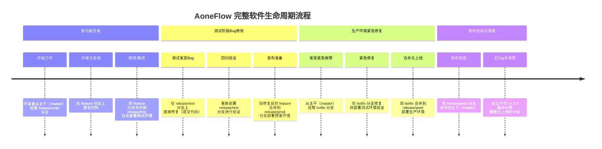

+++
date = '2026-08-25T14:49:59+08:00'
draft = false
title = 'AoneFlow分支管理模型介绍'
slug = 'aoneflow-branch-management-model'
description = 'AoneFlow 是阿里巴巴内部广泛使用的分支管理模型，其核心特点是**通过环境对应的 release 分支来灵活组装 feature**，既避免了 GitFlow 的繁琐，又解决了 TrunkBased 难以管理多版本并行的问题。'
categories = ['效率工具']
tags = ['AoneFlow', '分支管理模型', 'GitFlow', '团队开发']
+++

AoneFlow 是阿里巴巴内部广泛使用的分支管理模型，其核心特点是**通过环境对应的 release 分支来灵活组装 feature**，既避免了 GitFlow 的繁琐，又解决了 TrunkBased 难以管理多版本并行的问题。

下面以 **Mermaid 图表** 结合文字，完整展示 AoneFlow 在软件生命周期中的三个核心场景：新功能开发、测试阶段 Bug 修复、以及生产环境紧急补丁。

---

### 核心角色与分支定义

在开始之前，先明确 AoneFlow 仅有的三种分支类型：
- **主干分支 （master/main）** ：始终与线上正式环境代码保持一致，是最稳定的代码源。
- **特性分支 （feature/*）** ：用于开发新功能或修复非紧急 Bug，从主干拉取。
- **发布分支 （release/*）** ：对应不同的部署环境（如 `release/test`， `release/prod`），用于组装和验证待发布的特性。

---

### 完整生命周期流程图 （Mermaid）

---

### 场景一：新功能开发与上线

假设需要开发“订单优惠券”功能。

1.  **拉取特性分支**：从最新的主干（master）拉出一条分支 `feature/order-coupon`。**注意：主干永远是最新线上版本，所有开发均不允许直接提交主干**。
2.  **开发与自测**：在 `feature/order-coupon` 上进行代码提交。
3.  **合并形成测试发布分支**：当功能开发完成，从主干拉出一条测试环境专用分支 `release/test`，然后将 `feature/order-coupon` 合并进去。部署此分支到测试环境供 QA 验证。
4.  **合入预发/生产分支**：测试通过后，将 `feature/order-coupon` 再合并到预发环境对应的发布分支（如 `release/pre` 或 `release/prod`），进行上线前的最后验证。

> 如果临时决定本次发布不上线“优惠券”功能，在 AoneFlow 中只需**删除并重建 `release/prod` 分支，不合并该 feature 即可**，无需痛苦的“剔代码”操作。

---

### 场景二：测试环境中发现 Bug 的修改

在测试环境（`release/test`）验证时发现“优惠券计算金额错误”。

1.  **直接在发布分支修复**：AoneFlow 允许开发者在对应的发布分支（`release/test`）上直接提交代码来修复 Bug。这种做法比在 feature 分支修复再合并更快，适合测试阶段的快速迭代。
2.  **同步回特性分支（重要）**：**修复完成后，务必将改动同步合并回 `feature/order-coupon` 分支**。这样能保证后续从主干拉取新分支时，不会丢失这个 Bugfix。
3.  **继续推进上线**：将包含修复的 `feature/order-coupon` 重新合并到 `release/prod`，准备上线。

---

### 场景三：生产环境紧急 Bug 修复 （Hotfix）

线上发生严重故障（如支付接口超时），需要立即修复。

1.  **从主干拉取修复分支**：由于主干即线上版本，直接从主干拉出分支 `hotfix/payment-timeout` 或 `release/hotfix-payment`。
2.  **修复与验证**：在修复分支上完成代码修改，并**将其合并到测试环境对应的 release 分支**进行自动化测试和验证。
3.  **合入生产发布分支**：验证通过后，将修复分支合并到 `release/prod` 分支，触发紧急上线流水线。
4.  **同步至所有开发中分支（防止回潮）**：线上修复完成并发布后，**必须将此 Hotfix 同步合并回所有正在开发中的 feature 分支**，防止它们后续上线时把旧 Bug 又带回去。

---

### 发布完成：闭环操作

当 `release/prod` 分支成功部署到线上后，流程进入收尾阶段：

1.  **合并回主干**：将 `release/prod` 合并回 `master` 分支，确保主干再次与线上最新状态一致。
2.  **打标签 （Tag）** ：在主干上为此次发布打上版本号标签，如 `v2.3.0` 或 `v2.3.1-hotfix`，便于版本回溯。
3.  **清理分支**：删除已经上线的 `release/prod` 分支以及对应的 `feature/order-coupon` 或 `hotfix/*` 分支，保持仓库整洁。

---

### 总结：AoneFlow 的独特优势

| 维度           | AoneFlow 特点                            | 相比 GitFlow 的好处                                                            |
| :------------- | :--------------------------------------- | :----------------------------------------------------------------------------- |
| **分支数量**   | 只有 3 种（主干、特性、发布）            | 没有永久的 develop 分支，极大减少合并冲突                                      |
| **发布灵活性** | 动态组装 release 分支                    | 发布前可随时增减功能，无需 revert 代码历史                                     |
| **环境映射**   | release 分支与测试/预发/生产环境一一对应 | 流水线配置清晰，天然支持多环境隔离部署                                         |
| **紧急修复**   | Hotfix 流程即 release 分支流程           | 流程统一，不存在 GitFlow 中 hotfix 既要合并主干又要合并 develop 的双重遗忘风险 |