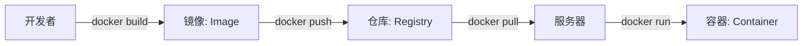
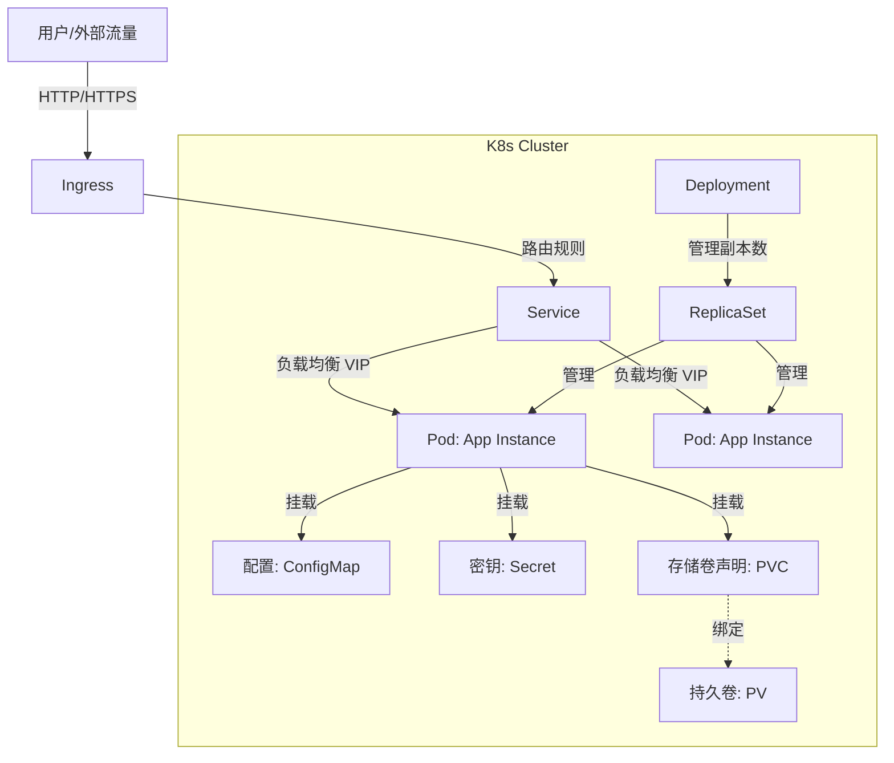

+++
date = '2026-08-24T17:46:57+08:00'
draft = false
title = 'Docker与Kubernetes核心概念图解'
slug = 'docker-kubernetes-core-concepts'
aliases = ['/posts/docker与kubernetes核心概念图解/']
description = '通过图解方式剖析 Docker 与 Kubernetes 的核心概念：镜像与容器、控制平面架构、Pod、Deployment、Service、Ingress 以及存储配置对象的关系与设计哲学。'
categories = ['后端开发']
tags = ['Docker', 'Kubernetes', 'K8s', '容器', '云原生']
+++

Kubernetes (K8s) 已经成为云时代的“操作系统”。对于开发者而言，理解 K8s 不仅仅是运维的工作，更是设计高可用、可扩展架构的基础。本文通过图解方式，深入浅出地剖析 Docker 与 K8s 的核心概念及其背后的设计哲学。

## 1. 为什么需要 Docker与 Kubernetes？

*   **Docker**：解决了“**运行环境一致性**”问题。Build once, Run anywhere.
*   **Kubernetes**：解决了“**规模化运维**”问题。它负责自动化部署、扩展和管理容器化应用。

## 2. Docker 核心概念

Docker 的本质是利用 Linux 内核的 **Namespace** (资源隔离) 和 **Cgroups** (资源限制) 技术，加上 **UnionFS** (分层文件系统) 构建的轻量级虚拟化。

### 2.1 镜像 (Image) vs 容器 (Container)
*   **Image (镜像)**：程序的“安装包”。它是**只读**的，由多层文件系统叠加而成（Layered Storage）。
*   **Container (容器)**：镜像的“运行实例”。它在镜像层之上加了一层**可读写层**。容器本质上就是宿主机上的一个特殊进程。

### 2.2 核心流程图

## 3. Kubernetes 架构概览

K8s 是一个典型的 Master-Slave 架构。

### 3.1 控制平面 (Control Plane / Master)
集群的大脑，负责决策。
*   **API Server**：唯一的入口，所有组件都通过它通信，RESTful API。
*   **etcd**：集群的数据库，存储所有状态信息（一致性高可用键值对）。
*   **Scheduler**：调度器，决定 Pod 应该运行在哪个 Node 上（资源匹配）。
*   **Controller Manager**：控制器，确保集群状态符合预期（如：副本数维持在 3 个）。

### 3.2 工作节点 (Worker Node)
干活的节点。
*   **Kubelet**：节点管家，向 API Server 汇报状态，管理 Pod 生命周期。
*   **Kube-Proxy**：网络代理，维护节点上的网络规则（iptables/IPVS），实现 Service 负载均衡。
*   **Container Runtime**：真正运行容器的引擎 (Docker / containerd)。

## 4. K8s 核心对象：开发者必须掌握的词汇

在 K8s 中，一切皆资源（Resource），通过 YAML 文件定义。

### 4.1 Pod：最小调度单元
**为什么 K8s 最小单位不是 Container 而是 Pod？**
Pod 是一组紧密关联的容器集合（就像豌豆荚里的豌豆）。
*   **共享网络**：Pod 内所有容器共享同一个 IP 和端口空间（localhost 通信）。
*   **共享存储**：Pod 内容器可以挂载同一个 Volume 共享数据。
*   **生命周期**：同生共死。

> **比喻**：Pod 就像一台“逻辑主机”，里面的容器就是这台主机上运行的进程。

### 4.2 负载控制器 (Workloads)
*   **Deployment**：最常用的控制器，用于管理**无状态应用** (Web Server, API)。
    *   功能：定义副本数 (Replicas)、滚动更新 (Rolling Update)、回滚。
    *   机制：Deployment 管理 ReplicaSet，ReplicaSet 管理 Pod。
*   **StatefulSet**：用于管理**有状态应用** (Redis, MySQL, Kafka)。
    *   特点：拥有稳定的网络标识 (redis-0, redis-1) 和有序的部署/扩缩容。
*   **DaemonSet**：**守护进程**。保证每个 Node 上都运行一个 Pod 副本。
    *   场景：日志采集 (Fluentd)、监控 Agent (Node Exporter)。
*   **Job / CronJob**：一次性任务或定时任务。

### 4.3 网络与服务发现
*   **Service**：Pod 的 IP 是会变的（重启后变化），Service 定义了一组 Pod 的访问策略，提供**稳定的 VIP (Virtual IP)** 和 DNS 名称。
    *   `ClusterIP`：默认，仅集群内部访问。
    *   `NodePort`：在每个 Node 上开放端口，供外部访问。
    *   `LoadBalancer`：使用云厂商的负载均衡器。
*   **Ingress**：集群的**HTTP/HTTPS 入口网关**。
    *   作用：七层路由（根据 Host 或 Path 转发到不同的 Service）、SSL 卸载。

### 4.4 配置与存储
*   **ConfigMap**：明文配置（配置文件、环境变量）。
*   **Secret**：敏感配置（密码、证书），Base64 编码。
*   **PersistentVolume (PV) & PVC**：
    *   **PVC (Claim)**：开发者的“存储需求申请单”（我要 10G 硬盘，读写模式）。
    *   **PV**：运维配置的“真实存储资源”（NFS, AWS EBS）。
    *   K8s 自动将 PVC 绑定到合适的 PV 上。

## 5. 核心对象关系图解

## 6. 总结

*   **Pod** 是原子，**Deployment** 是编排。
*   **Service** 是内部路标，**Ingress** 是外部大门。
*   **ConfigMap/Secret** 是背包，**PV/PVC** 是硬盘。

理解了这些概念，你就掌握了 K8s 的 80% 核心逻辑。接下来的重点是动手编写 YAML，实践“声明式 API”的威力。
