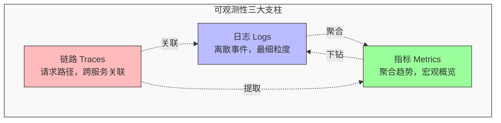
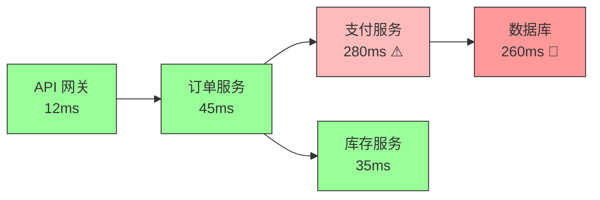
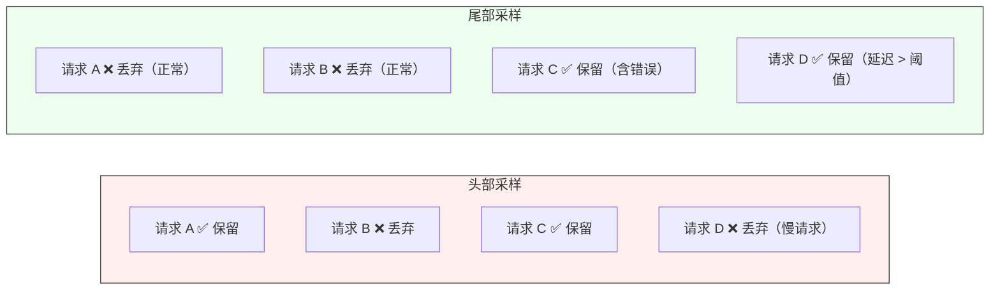
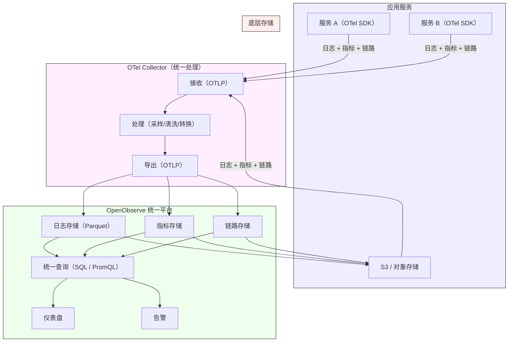

+++
date = '2026-09-15T16:50:00+08:00'
draft = false
title = '一套OTel加OpenObserve，搞定可观测性'
slug = 'otel-openobserve-observability'
aliases = ['/posts/observability-engineering-practice-logs-metrics-traces/']
description = '从可观测性三大支柱（日志、指标、链路追踪）的工程实践出发，剖析每根支柱该采集什么、怎么采集、怎么关联，并以 OpenObserve 为例展示如何用统一平台落地整套可观测性体系。'
categories = ['后端开发']
tags = ['可观测性', 'OpenTelemetry', 'OpenObserve', '运维']
+++

系统上线之后，最危险的状态不是"报警响了"，而是"出了问题却看不见问题在哪"。可观测性（Observability）要解决的就是这个问题：让系统的外部输出足以解释其内部状态，使团队能够在不修改代码的前提下，通过观察输出来定位和诊断异常行为。


可观测性通常被归纳为三大支柱：日志（Logs）、指标（Metrics）、链路追踪（Traces）。三者各有分工，缺一不可。这篇文章从工程实践的角度，逐一拆解每根支柱该怎么做，核心主张只有一个：**三大支柱统一用 OpenTelemetry 采集，后端统一落到 OpenObserve 这一个平台上**——不再拼凑 Prometheus、ELK、Grafana 等多套工具链。

## 三大支柱的关系

在展开每根支柱的细节之前，先要明确它们之间的关系。日志记录离散事件，指标聚合趋势变化，链路追踪串联请求路径——三者解决的是不同粒度的问题：



一个典型的排障流程是：指标告警触发（"错误率突增"）→ 链路追踪定位到具体服务和 span（"订单服务的支付接口延迟飙升"）→ 日志下钻查看具体错误信息（"数据库连接池耗尽"）。三者形成从宏观到微观的完整诊断链路。

## 统一采集标准：OpenTelemetry

在展开三大支柱的细节之前，先明确采集层的统一标准。过去，日志用 Filebeat/Fluentd、指标用 Prometheus Agent、链路用 Jaeger SDK——三种信号对应三套采集工具，维护成本高，数据格式不统一，关联分析困难。

[OpenTelemetry](https://opentelemetry.io/)（OTel）的出现终结了这种局面。它提供了统一的 API 和 SDK，覆盖日志、指标、链路三种信号的采集与导出，且与具体后端实现无关。选择 OTel 意味着：

- **一套 SDK 覆盖全部信号**：服务中只需引入一个 OTel SDK，日志、指标、链路追踪的采集全部搞定，不需要为每种信号引入不同的库。
- **一个 Collector 统一处理**：OTel Collector 作为唯一的采集代理，接收、处理、转发所有信号，替代 Filebeat、Prometheus Agent、Jaeger Agent 等多个组件。
- **不被后端锁定**：OTel 的导出协议（OTLP）是开放标准，今天导出到 OpenObserve，明天想换后端也无需改代码。

后面的三大支柱章节中，所有采集实践都基于 OTel 展开。

## 日志：结构化是前提

日志是最早被广泛使用的可观测性手段，但"有日志"和"有可用的日志"之间差距很大。工程实践中最常见的问题是：日志格式不统一、信息不全、量太大反而找不到关键内容。

### 结构化日志而非自由文本

`2026-09-15 10:32:45 ERROR something went wrong` 这种日志在开发阶段够用，在生产环境中几乎无用。结构化日志要求每条日志都包含可查询的字段：时间戳、级别、服务名、请求 ID、用户 ID、关键业务参数等。这样做的好处是可以用 SQL 式的查询语言进行精确过滤，而不是靠正则匹配碰运气。

```json
{
  "timestamp": "2026-09-15T10:32:45.123Z",
  "level": "ERROR",
  "service": "order-service",
  "trace_id": "abc123def456",
  "span_id": "span789",
  "user_id": "u_10086",
  "message": "Payment gateway timeout",
  "order_id": "ORD-20260915-0042",
  "duration_ms": 30000
}
```

### 日志分级与采样

不是所有日志都值得长期保存。实践中建议按级别分层处理：

- **ERROR / FATAL**：全量采集，长期保留，触发告警。这类日志数量少但价值高。
- **WARN**：全量采集，中期保留（7–30 天）。用于趋势分析和潜在问题预警。
- **INFO**：按需采集或采样保留。生产环境中 INFO 日志量巨大，全量保留成本高昂。
- **DEBUG**：默认关闭，仅在排查问题时临时开启。

采样策略也值得设计：正常状态下可以按固定比例采样（比如 10%），当错误率超过阈值时自动切换到全量采集。这样既控制成本，又不在关键时刻丢失信息。

### 通过 OTel 统一采集日志

传统做法是在每台服务器上部署 Filebeat 或 Fluentd 来采集日志文件，这种方式需要额外维护一套日志采集管道。在 OTel 体系中，日志采集有两种方式：

- **应用内直接采集**：通过 OTel SDK 的 Logs Bridge API，应用代码直接以结构化格式发出日志，自动携带 `trace_id`、`span_id` 等上下文信息，无需额外的日志文件解析。
- **文件采集**：对于无法改造的老系统，OTel Collector 的 `filelog` receiver 可以替代 Filebeat，直接读取日志文件并转发到 OpenObserve。

推荐优先使用应用内直接采集——日志天然携带链路上下文，省去了日志文件解析和 trace_id 注入的额外工作。

## 指标：从"看得见"到"看得懂"

指标是对系统行为的数值聚合，适合回答"整体怎么样"和"趋势如何"这类问题。相比日志，指标的存储成本低得多、查询速度快得多，是构建仪表盘和告警的首选数据源。

### 四类基础指标

Google SRE 的"四个黄金信号"是一个好的起点：

| 信号 | 含义 | 示例 |
|------|------|------|
| **延迟** | 请求处理耗时 | p50/p95/p99 延迟 |
| **流量** | 系统承受的请求量 | QPS / 并发连接数 |
| **错误** | 请求失败的比率 | HTTP 5xx 比例 |
| **饱和度** | 资源使用程度 | CPU / 内存 / 连接池使用率 |

在此基础上，业务指标同样重要：订单量、支付成功率、注册转化数。技术指标告诉你"系统健不健康"，业务指标告诉你"用户受没受影响"。

### 指标采集的工程约定

- **命名规范**：统一前缀 + 模块 + 度量名，如 `order_service_payment_duration_seconds`。命名混乱是指标体系失控的起点。
- **标签（Label）设计**：标签用于维度过滤，但标签组合的基数（cardinality）不能太高。`user_id` 不适合作为指标标签（基数太高），`region`、`service`、`status_code` 是好的标签选择。
- **统一用 OTel 采集**：不再单独部署 Prometheus Agent 拉取指标。OTel SDK 在应用内采集指标后，通过 OTLP 协议推送到 OTel Collector，再由 Collector 转发到 OpenObserve。一套采集管道覆盖所有信号，不需要为指标再维护一套独立的采集体系。OpenObserve 原生支持 PromQL 查询，过去基于 Prometheus 建立的查询和告警规则可以无缝迁移。

### 告警设计：避免狼来了

指标最直接的消费方式是告警，但告警设计不当反而会造成"告警疲劳"——值班人员对大量低价值告警脱敏，真正严重的问题反而被忽略。

好的告警应该满足：

- **可操作**：收到告警后知道该做什么，而不是只知道"有个数字不对"。
- **有上下文**：告警消息里包含当前值、阈值、影响范围，最好附带仪表盘链接。
- **分级响应**：P0 电话通知、P1 即时消息、P2 邮件或工单。不是所有异常都需要半夜叫醒人。

## 链路追踪：看见请求的完整旅程

在微服务架构下，一个用户请求可能经过网关、订单服务、支付服务、库存服务、数据库，最终返回结果。如果中间某个环节慢了或失败了，只看单个服务的日志很难还原全貌。链路追踪解决的就是这个问题——把一个请求在所有服务中的调用路径串联起来，形成可视化的瀑布图。

### 从链路到定位

一条完整的 trace 长这样：



当指标告警告诉你"支付接口延迟飙升"时，链路追踪能直接指出瓶颈在支付服务调用数据库的环节——耗时 260ms，占整条链路的 80% 以上。接下来再结合日志查看具体原因（连接池耗尽？慢查询？锁等待？），定位效率比盲翻日志高一个数量级。

### 采样策略：全量采集的代价与取舍

链路追踪的数据量远比日志更大——一个请求可能产生数十个 span，每个 span 携带序列化属性和时间戳。在高流量系统中，全量采集所有 trace 的存储成本很快会变得不可承受。因此，采样（Sampling）不是可选项，而是链路追踪工程中必须面对的设计决策。

**头部采样（Head-based Sampling）** 是最简单的策略：在 trace 的根 span 创建时，按固定比例决定是否保留整条 trace。比如设置 10% 的采样率，意味着每 10 个请求中只有 1 个会被完整记录。这种方式实现简单、开销低，但有一个致命缺陷——**它不区分"正常请求"和"异常请求"**。一个耗时 5 秒的错误 trace 和一个 50 毫秒的正常 trace 被保留的概率完全相同。真正有诊断价值的异常链路，大概率在采样中被丢弃了。

**尾部采样（Tail-based Sampling）** 解决了这个问题：先完整收集所有 trace，等 trace 结束后再根据结果决定哪些值得保留。判断条件可以包括：

- 是否包含错误状态（error span）
- 延迟是否超过阈值（如 p99 以上的慢请求）
- 是否来自特定服务或特定操作
- 是否满足自定义业务规则

这样做的效果是：正常的快速请求被大量丢弃，而异常的、慢的、出错的 trace 被全量保留——恰好是排障时最需要的那部分数据。



工程实践中，两者通常组合使用：在 SDK 端做头部采样（降低传输开销，比如只发送 20% 的 trace），在 Collector 端做尾部采样（从这 20% 中进一步筛选出有价值的 trace 入库）。OTel Collector 内置了 `tail_sampling` processor，支持按延迟、状态码、概率等多种策略组合配置。

尾部采样的代价是需要临时缓存所有 trace 直到其结束，对内存有一定要求。在高流量场景下，需要合理设置缓存窗口和内存上限，避免 Collector 因内存不足而丢数据。但对于大多数团队来说，"保留有价值的 trace"比"保留更多 trace"更实际——存储预算有限时，采样策略本身就是一种投资分配。

## 统一平台：从分散到关联

三大支柱各自落地不难，难的是把它们放在同一个平台里关联使用。如果日志用一套系统、指标用一套系统、链路用一套系统，排障时需要在三个工具之间来回切换，关联分析的成本很高。

统一平台的核心价值在于**关联**：从指标告警直接跳转到对应的链路追踪，从 trace 的某个 span 直接下钻到对应时间段的日志——这种无缝衔接的体验，才是可观测性体系真正发挥作用的關鍵。

### 为什么选择 OpenObserve

传统的可观测性技术栈通常是这样的组合：Prometheus 管指标、Loki 管日志、Tempo/Jaeger 管链路、Grafana 做展示——四套系统各自部署、各自维护，数据之间的关联要靠 Grafana 的 data source 配置来桥接。这不仅增加了运维负担，也让跨信号的关联分析变得脆弱。

[OpenObserve](https://github.com/openobserve/openobserve) 的价值在于，它用一个平台替代了上述整套拼凑的架构：

- **真正的统一平台**：日志、指标、链路追踪在同一个平台中存储、查询、告警，共享 SQL 查询语言和仪表盘。不再需要维护 Prometheus + Loki + Tempo + Grafana 四套系统。
- **OpenTelemetry 原生**：直接接收 OTLP 协议数据，OTel Collector 采集的所有信号直接写入 OpenObserve，无需额外适配层。
- **存储成本低**：采用 Parquet 列式存储 + S3 原生架构，相比 Elasticsearch 存储成本降低最高 140 倍。对于日志和链路这种数据量大的信号，这一点直接影响可观测性体系的可持续性。
- **部署简单**：单二进制文件部署，两分钟即可启动。相比之下，Prometheus + Loki + Tempo + Grafana 的组合需要部署和调优四个独立组件。
- **查询友好**：日志和链路用 SQL 查询，指标支持 SQL 和 PromQL——过去在 Prometheus 中编写的 PromQL 查询可以直接复用，不需要重新学习。



### 落地步骤建议

可观测性体系的建设不需要一步到位，但方向要明确：**从第一天起就用 OTel + OpenObserve 的统一架构**，避免先搭传统工具链再迁移的弯路。可以分阶段接入：

**第一阶段：日志集中化。** 在各服务中接入 OTel SDK 的 Logs Bridge API，结构化日志通过 OTLP 直接写入 OpenObserve。对于无法改造的老系统，用 OTel Collector 的 `filelog` receiver 替代 Filebeat 读取日志文件。这一步解决"日志找不到、搜不到"的基本问题。

**第二阶段：指标体系搭建。** 定义核心服务的黄金信号指标（延迟、流量、错误率、饱和度），通过 OTel SDK 采集后推送到 OpenObserve。不需要部署 Prometheus，过去的 PromQL 查询可以直接复用。在 OpenObserve 中构建基础仪表盘和告警规则，这一步解决"系统健不健康靠感觉"的问题。

**第三阶段：链路追踪接入。** 在核心链路中通过 OTel SDK 开启 Trace 采集，实现跨服务的请求追踪。SDK 集成后，链路数据自动与日志共享 `trace_id`，三者关联开箱即用。这一步成本最高（需要改造代码），但价值也最大——它让排障从"翻日志"升级为"看链路"。

**第四阶段：关联与自动化。** 配置 OTel Collector 的 Pipeline 做尾部采样、数据清洗和日志转指标，设置 OpenObserve 中的告警与事件响应联动。这一步让可观测性从"被动查看"升级为"主动发现"。

## 几个容易踩的坑

**数据量大就关掉一些。** 不是所有服务都需要同等级的可观测性。核心链路全量采集，边缘服务采样或降级，把存储预算花在刀刃上。

**告警阈值要基于实际数据。** 不要拍脑袋定阈值——先看一周的历史数据，了解正常波动范围，再设定告警线。否则要么漏报，要么误报不断。

**别忽视数据管道。** 原始数据直接入库，很快会被噪声淹没。在采集和存储之间加一层 Pipeline（OpenObserve 内置了可视化 Pipeline 编辑器），做日志清洗、字段提取、敏感信息脱敏，入库的数据质量会好很多。

**可观测性本身也需要可观测性。** 采集 Agent 是否正常运转？数据有没有丢失？延迟有多大？这些元指标也应该被监控，否则可观测性体系本身就成了盲区。

## 小结

可观测性不是一个产品，而是一种工程实践。日志、指标、链路追踪三大支柱各有分工，又相互补充：日志提供细节，指标呈现趋势，链路串联路径。

采集层用 OpenTelemetry 统一三种信号，后端用 OpenObserve 统一存储、查询和告警——这套架构的核心优势是**简单**：一套 SDK、一个 Collector、一个平台，替代了 Prometheus + Loki + Tempo + Grafana + ELK 的拼凑组合。运维负担降下来了，可观测性体系才可持续演进。

但工具只是手段，更重要的是把结构化日志规范、指标命名约定、采样策略、告警设计这些工程实践做到位。数据质量上去了，可观测性才能真正转化为排障效率和系统可靠性的提升。
