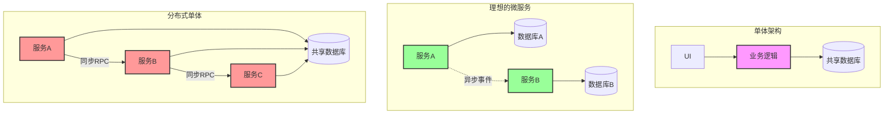
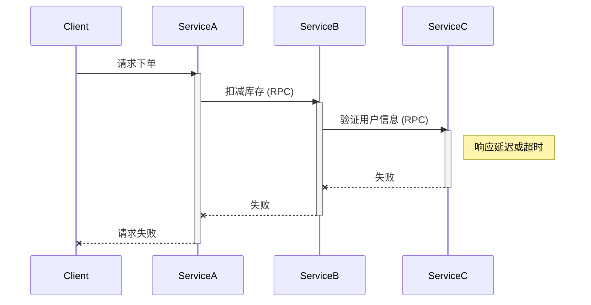
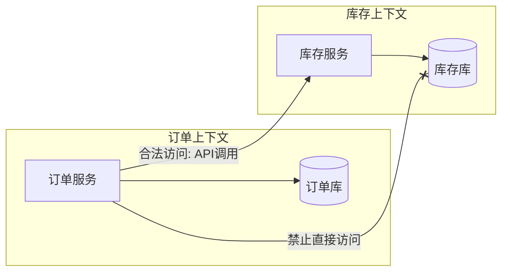

+++
date = '2026-08-18T15:13:53+08:00'
draft = false
title = '不要落入分布式单体的陷阱'
+++

# 不要落入分布式单体的陷阱

在当今的软件架构领域，“微服务”无疑是最热门的词汇之一。无数团队怀揣着对灵活性、可扩展性和独立部署的憧憬，从单体架构（Monolith）迁移到微服务架构。然而，很多团队在拆分服务后，却发现自己陷入了一个更糟糕的境地：**分布式单体（Distributed Monolith）**。

本文将深入探讨什么是分布式单体，它有哪些典型特征，以及我们如何避免落入这个陷阱。

## 什么是分布式单体？

分布式单体是指一个系统在物理上是分布式的（由多个服务组成），但在逻辑上却是紧密耦合的单体。它继承了单体架构的所有缺点（耦合度高、难以变更），同时又引入了分布式系统的所有复杂性（网络延迟、数据一致性、故障排查困难）。

我们可以通过下图来直观地对比三种架构形态：

如上图所示，分布式单体虽然看起来像微服务（有多个服务节点），但它们之间通过强同步调用和共享数据库死死地绑在一起。

## 分布式单体的四大陷阱特征

### 1. 共享数据库（The Shared Database）

这是最常见也最致命的陷阱。多个服务直接访问同一个数据库，甚至共享同一个表。

*   **现象**：服务 A 修改了表结构，导致服务 B 和服务 C 崩溃。
*   **后果**：服务之间失去了数据封装性，任何数据变更都需要跨团队协调，独立部署成为空谈。

### 2. 强耦合的同步调用链（The Synchronous Knot）

服务之间通过 HTTP/gRPC 进行深度的同步调用链。

*   **现象**：前端发起一个请求，服务 A 调服务 B，B 调 C，C 调 D... 如果 D 响应慢或挂了，整个请求链条就会超时或失败。
*   **后果**：系统的可用性是所有服务可用性的乘积（越来越低）。性能受限于调用链中最慢的一环。网络抖动会导致级联故障（Cascading Failures）。

### 3. 共享代码库与模型（The Shared Code/Model）

为了“复用”，多个服务共享了大量的 DTO、实体对象或工具类库（Common Jar/Dll）。

*   **现象**：修改一个公共类库中的字段，需要所有引用它的微服务重新编译和部署。
*   **后果**：公共库变成了新的“单体”，任何微小的改动都牵一发而动全身。

### 4. 必须统一部署（Lock-step Deployment）

由于上述的耦合，服务不能独立上线。

*   **现象**：“为了上线服务 A 的新功能，我们需要同时上线服务 B 和服务 C，因为接口变了。”
*   **后果**：失去了微服务的核心优势——独立部署。部署变得笨重、高风险，且需要长时间的停机维护。

## 造成的后果

落入分布式单体的陷阱，你会发现：

*   **开发效率降低**：跨团队沟通成本极高。
*   **运维复杂度爆炸**：你需要管理几十个服务，却得不到微服务的好处。
*   **性能下降**：网络开销和序列化开销显著增加，却因为同步阻塞无法并发处理。
*   **排查问题困难**：一个报错可能在几十个服务间跳跃，日志难以追踪。

## 如何破局：回归微服务的本质

要避免分布式单体，我们需要坚持**低耦合、高内聚**的原则。

### 1. 数据库私有化（Database per Service）

每个服务必须拥有自己的数据库（或独立的 Schema）。其他服务只能通过 API 访问数据，严禁直接连库。

### 2. 拥抱异步与事件驱动（Event-Driven Architecture）

尽量减少同步的 Request/Response 调用，改用事件通知。

*   **做法**：订单服务创建订单后，不直接调库存服务，而是发布一个 `OrderCreated` 事件。库存服务订阅该事件并处理。
*   **好处**：解耦了发送者和接收者；提高了系统的响应速度和吞吐量；服务不可用时消息可以堆积在队列中，实现削峰填谷。

### 3. 限界上下文（Bounded Context）

利用 DDD（领域驱动设计）正确划分服务边界。

*   不要按技术层（Controller/Service/Dao）拆分，要按业务能力（订单/支付/物流）拆分。
*   确保服务内部的业务逻辑是高度内聚的。

### 4. 契约测试（Consumer-Driven Contracts）

使用契约测试（如 Pact）来保证服务间的接口兼容性，而不是依赖共享代码库。让服务提供者和消费者解耦，但又能安全地演进 API。

### 5. 容错设计

在不得不进行同步调用的地方，引入**熔断（Circuit Breaker）**、**重试（Retry）** 和 **舱壁隔离（Bulkhead）** 机制，防止局部故障拖垮整个系统。

## 总结

微服务不是银弹，它是一种用“运维复杂度”换取“开发敏捷性”的架构权衡。如果你在拆分服务时，忽略了**独立性**和**解耦**，那么你得到的不仅不是微服务，反而是最难维护的架构模式——分布式单体。

**时刻警惕：**
*   如果两个服务必须同时部署，它们就不是微服务。
*   如果一个服务挂了导致所有服务都不可用，这也不是微服务。
*   如果服务间共享数据库表，这绝对不是微服务。

保持边界清晰，数据独立，通信异步，你才能真正享受微服务带来的红利。
