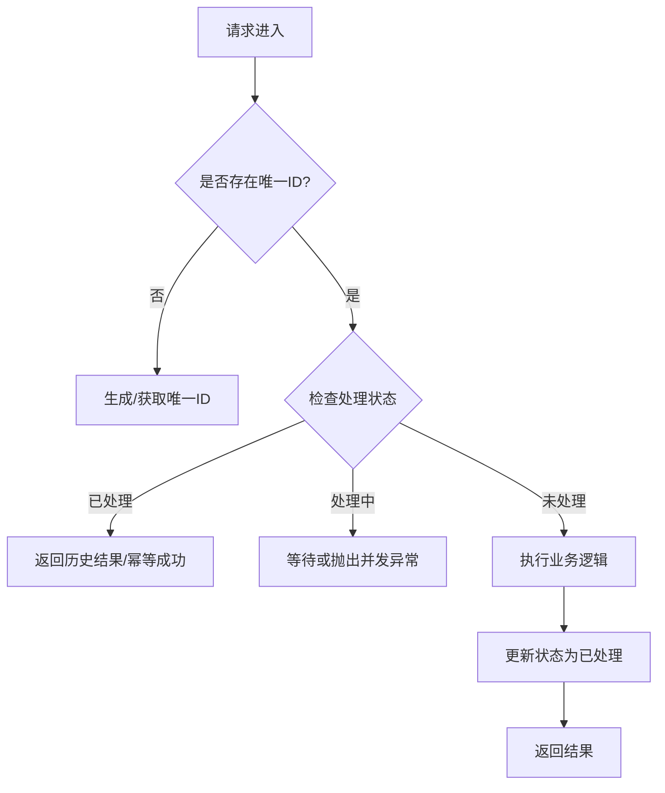

+++
date = '2026-08-21T14:24:45+08:00'
draft = false
title = '业务幂等性设计与落地指南'
description = '从概念、场景到解决方案全面解析业务幂等性设计：数据库唯一约束、乐观锁、Token 机制、状态机与去重表五大方案的选型对比与避坑实践，保障分布式系统数据一致。'
categories = ['后端开发']
tags = ['幂等性', '分布式系统', '微服务', 'Redis']
+++

在分布式系统架构中，**幂等性（Idempotency）** 是保证数据一致性和系统健壮性的核心机制。本文将从概念、场景、解决方案到避坑指南，全方位解析如何在业务代码中落地幂等性设计。

## 1. 什么是幂等性？

### 1.1 定义
在数学中，幂等元素是指被自己重复运算（或函数重复执行）多次后，结果等于它本身的元素，即 $f(f(x)) = f(x)$。

在软件工程中，**幂等性是指对同一个系统接口，使用相同的参数发起一次或多次请求，产生的结果（对服务器资源的影响）是一致的。**

### 1.2 为什么需要幂等性？
在单体应用中，我们往往假设网络是可靠的。但在分布式系统中，网络是不可靠的，以下场景都会导致重复请求：
*   **前端重复提交**：用户手抖连点两次“提交”按钮。
*   **网络波动**：请求已送达服务端并处理完成，但响应丢包，客户端误以为失败而发起重试。
*   **消息队列重试**：消费者处理消息成功，但 ACK 失败，Broker 重新投递消息。
*   **RPC 重试机制**：微服务框架（如 Dubbo、Feign）通常配置了超时重试策略。

如果没有幂等性保护，重复请求会导致重复扣款、重复发货、数据错乱等严重事故。

## 2. 核心设计思路

实现幂等性的核心逻辑可以归纳为三步曲：
1.  **唯一标识（Unique ID）**：识别是否为同一个请求。
2.  **状态记录（State Recording）**：记录请求的处理状态。
3.  **校验与拦截（Check & Block）**：在执行业务前校验状态，如果已处理则直接返回结果。



## 3. 常用解决方案详解

### 3.1 数据库唯一约束（最简单可靠）

利用数据库的 `UNIQUE KEY` 约束特性，保证同一条数据不会被插入两次。

*   **场景**：用户注册（唯一用户名）、创建订单（唯一订单号）。
*   **实现**：
    ```sql
    CREATE TABLE t_order (
        id BIGINT AUTO_INCREMENT PRIMARY KEY,
        order_no VARCHAR(64) NOT NULL,
        UNIQUE KEY uk_order_no (order_no)
    );
    ```
    ```java
    try {
        orderRepository.save(order);
    } catch (DuplicateKeyException e) {
        // 捕获唯一索引冲突异常，视为幂等成功，返回已存在的订单信息
        return orderRepository.findByOrderNo(order.getOrderNo());
    }
    ```
*   **优点**：实现简单，无需引入额外组件，数据强一致性。
*   **缺点**：分库分表时需要保证分片键包含唯一索引；数据库写性能可能成为瓶颈。

### 3.2 乐观锁（Optimistic Locking）

通过版本号（version）机制控制并发更新。

*   **场景**：更新账户余额、扣减库存。
*   **实现**：
    1.  查询数据，获取当前版本号 `version`。
    2.  更新时带上版本号作为条件。
    ```sql
    UPDATE t_account 
    SET balance = balance - 100, version = version + 1 
    WHERE id = 1 AND version = 10;
    ```
    如果影响行数为 0，说明数据已被修改，请求过期或重复，抛出异常或重试。
*   **优点**：无锁编程，性能高。
*   **缺点**：在竞争激烈的场景下失败率高，需要配合重试机制。

### 3.3 Token 机制（防止前端重复提交）

采用“一锁二判三更新”的模式，通常结合 Redis 使用。

*   **场景**：表单提交、支付请求。
*   **流程**：
    1.  **获取 Token**：客户端先请求服务端获取一个全局唯一的 Token，服务端将其存入 Redis（设过期时间）。
    2.  **提交请求**：客户端携带 Token 发起业务请求。
    3.  **校验 Token**：服务端校验 Token 是否存在。
        *   如果存在，**立即删除 Token**（原子操作），然后执行业务。
        *   如果不存在，说明是重复请求，直接拒绝。

*   **代码示例（Lua 脚本保证原子性）**：
    ```lua
    if redis.call('get', KEYS[1]) == ARGV[1] then
        return redis.call('del', KEYS[1])
    else
        return 0
    end
    ```
*   **注意**：**必须先删除 Token 再执行业务**。如果先执行业务再删 Token，业务执行完但在删 Token 前宕机，会导致 Token 未删，从而允许重复提交。

### 3.4 状态机幂等（业务层控制）

利用业务状态的流转约束来实现幂等。

*   **场景**：订单状态流转（待支付 -> 已支付 -> 已发货）。
*   **实现**：
    ```java
    // 只有当状态为 UNPAID 时才更新为 PAID
    int rows = orderRepository.updateStatus(orderId, OrderStatus.PAID, OrderStatus.UNPAID);
    if (rows == 0) {
        // 检查当前状态，如果是 PAID 则视为幂等成功，否则视为业务异常
        Order order = orderRepository.findById(orderId);
        if (order.getStatus() == OrderStatus.PAID) {
            return success;
        }
        throw new BusinessException("订单状态流转异常");
    }
    ```
*   **优点**：业务语义明确，不仅解决了幂等，还防止了状态回退。

### 3.5 去重表（Deduplication Table）

专门建立一张表用于记录已处理的请求 ID。

*   **场景**：消息队列（MQ）消费去重。
*   **实现**：
    业务表和去重表在同一个本地事务中操作。
    ```java
    @Transactional
    public void consumeMessage(String msgId, OrderData data) {
        // 1. 尝试插入去重表
        try {
            dedupRepository.insert(msgId); 
        } catch (DuplicateKeyException e) {
            log.warn("消息重复消费: {}", msgId);
            return;
        }
        
        // 2. 执行实际业务
        orderService.process(data);
    }
    ```
*   **优点**：利用数据库事务保证“去重记录”和“业务操作”的原子性。

## 4. 方案选型对比

| 方案               | 适用场景                 | 优点           | 缺点                     | 复杂度 |
| :----------------- | :----------------------- | :------------- | :----------------------- | :----- |
| **数据库唯一约束** | 插入型业务（如新增订单） | 简单、强一致   | 依赖数据库性能           | ⭐      |
| **乐观锁**         | 更新型业务（如扣库存）   | 性能好、无死锁 | 高并发下冲突多           | ⭐⭐     |
| **Token 机制**     | 前端防重提交             | 保护服务端资源 | 需多次交互，强依赖 Redis | ⭐⭐⭐    |
| **状态机**         | 流程流转（如订单状态）   | 业务逻辑清晰   | 仅限有状态流转的场景     | ⭐⭐     |
| **去重表**         | MQ 消费、跨表事务        | 适用性广       | 多一次 DB IO             | ⭐⭐⭐    |

## 5. 避坑指南与最佳实践

### 5.1 "先查后写" 不是幂等
很多新手喜欢这样写：
```java
if (orderRepository.exists(orderId)) {
    return;
}
orderRepository.save(order);
```
**这是错误的！** 在并发环境下，两个请求可能同时通过 `exists` 检查，然后同时执行 `save`，导致重复数据。必须利用数据库的锁机制（唯一索引或悲观锁）来兜底。

### 5.2 Token 机制的“先删还是后删”
*   **先执行业务，后删 Token**：业务执行成功但 Token 删除失败（如 Redis 抖动），导致 Token 还在，用户重试会重复执行业务。❌ **不推荐**
*   **先删 Token，后执行业务**：Token 删除了，业务执行失败。用户重试时发现 Token 没了，无法提交。这种情况用户体验稍差，但保证了数据安全。✅ **推荐**（通常配合重新获取 Token 流程）。

### 5.3 幂等接口的返回值
重复请求的返回值应当尽可能与首次请求保持一致，或者是友好的提示。
*   **创建类**：返回创建成功的资源 ID 或对象。
*   **更新类**：返回更新后的最新状态。
*   **错误提示**：如果是并发重复请求被拦截，应返回特定的错误码（如 `409 Conflict` 或业务码），告知客户端“请求处理中”或“已处理成功”。

### 5.4 锁的粒度
在使用分布式锁（如 Redis Lock）做幂等时，Key 的设计至关重要。
*   **太粗**：`lock:order` -> 所有订单操作串行，性能崩塌。
*   **太细**：`lock:order:timestamp` -> 无法识别同一业务主体的并发。
*   **建议**：`业务前缀:业务唯一ID`，如 `lock:pay:order_123456`。

## 6. 总结

幂等性是分布式系统的一道护身符。没有银弹，只有最适合的方案：
*   **前端防抖**：提升体验，挡住 90% 的无意重复。
*   **Token 机制**：防止恶意刷单和重复提交。
*   **数据库兜底**：唯一索引和状态机是最后一道防线，确保数据绝对准确。

设计系统时，请务必思考：“如果这个请求被重放了 10 次，我的系统数据还会对吗？”
