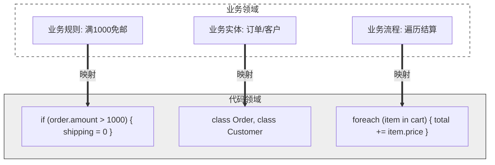

+++
date = '2026-08-31T14:04:58+08:00'
draft = false
title = '代码只是业务的映射'
slug = 'code-is-a-mapping-of-business'
description = '剖析软件开发的本质：软件是业务需求的数字化解决方案，图表是业务理解与技术设计之间的桥梁，代码是这一映射链条的最终实现形式。'
categories = ['架构设计']
tags = ['软件工程', '业务分析', '系统设计']
+++

每个软件项目，本质上都是一次翻译：把业务世界的规则、流程和关系，翻译成机器能执行的代码。业务是源头，代码是结果，中间隔着对业务的理解，以及把理解固化成设计的过程。这条链里最容易出问题的地方，往往不在编码本身，而在前面的环节——业务没理解透、设计没做扎实时，代码写得再工整，也只是在错误的地基上盖楼。

整个过程可以简化成下面这条链：

## 业务是软件的唯一起点

一个软件项目值不值得做、做成什么样，由业务问题决定。提高效率、降低成本、改善体验，这些目标先于任何一行代码存在；没有这些目标，代码就没有存在的理由。

业务自身的复杂度也直接决定系统的形态：一个商品展示页面和一个金融风控系统，背后代码在规模与结构上的差异，不是程序员水平造成的，而是业务复杂度造成的。需求决定设计、设计决定代码，在这个意义上是严格的对应关系，不是泛泛的说法。

## 理解业务是编码前的主要功课

动笔之前，先要把几个问题问清楚：业务要服务谁，核心流程怎么走，哪些规则是硬约束，状态如何流转，数据从哪里来、到哪里去，边界条件是什么。这些问题的答案通常不在需求文档里，而在业务人员的脑子里，要靠反复沟通、澄清、确认才能拿全。歧义在理解阶段消除成本最低，拖到设计阶段还能补救，带进代码里就成了返工。

很多代码质量问题追溯到源头，都不是编码技巧问题，而是业务理解偏差：审批流程的边界搞错了，状态流转的顺序理解反了，某个例外情况被当成常态处理。理解环节欠的债，会在后续每个环节不断放大。

## 图表：把理解固定下来，作为设计的依据

业务理解停留在几个人脑子里并不可靠，需要变成看得见、可以讨论、可以评审的东西，这就是流程图、时序图、ER 图等工具的用处。它们本质上是业务理解与技术实现之间的中间产物——把模糊的业务语言，第一次翻译成相对精确的技术语言。

图表在项目里通常承担三种职责：

- 团队内部对齐：架构师用组件图描述系统结构，开发人员用时序图描述调用顺序，数据模型用 ER 图描述关系。评审会上大家指着同一张图讨论，比各自脑补高效得多。
- 与业务方确认：流程图可以直接向业务方演示"你的流程在系统里是这样跑的"，用例图说明系统交付什么价值。理解不一致在这一层暴露，比上线之后暴露便宜得多。
- 设计推演：把一条业务规则画成图，常常会发现原来说不清楚的地方——某个分支从没人定义过，某个边界情况流程没有覆盖。画图本身就是一种低成本的设计验证。

图表不是一次性交付物，它同时承担知识留存：新人入职、项目交接，靠的是这些留下来的图，而不是离职同事的口述。所以业务变了，图要跟着改——过时的设计图比没有图更容易误导人。

## 代码：映射的最终形态

看图写码时，对应关系是明确的：一条业务规则对应一个条件分支，一个业务实体对应一个类或一张表，一个重复性流程对应一个循环，一次跨系统协作对应一段调用链。以"订单满 1000 免运费"为例，业务规则落到代码里就是一个判断；订单、客户对应 `Order`、`Customer` 两个类；遍历购物车结算对应一个循环。映射关系清楚，代码结构自然清楚——每个分支都问得出出处，需求变化时知道该动哪里。

代码不仅映射静态结构，也映射动态行为：一次请求如何被处理、状态如何迁移、异常如何响应，在时序图里都有对应。所以评审代码时最值得追问的问题是：这段代码对应的业务规则是哪一条？答不上来的地方，往往是链条脱节的地方。

## 链条断裂的代价

最常见的断法，是跳过理解和设计，直接从需求跳进代码。这样写出来的代码通常有几个共同特征：业务规则散落各处，同一个概念在不同文件里有不同叫法；模块边界不是按业务划分的，改一处牵连多处；新人接手只能靠猜，因为代码里看不出它为什么长成这个样子。这些问题不是"代码写得不够好"能概括的——映射的源头就是模糊的，后面怎么修补都补不回来。

## 每一环都在丢失信息

这条链的每一环都会损失一部分信息：沟通丢掉细节，图表丢掉上下文，代码丢掉意图。工程实践的大部分努力，其实都是在减少这种损耗——需求评审时多问一句，设计阶段多画一张图，编码时多想一层对应关系。链条越长，前面环节的投入越值得。
