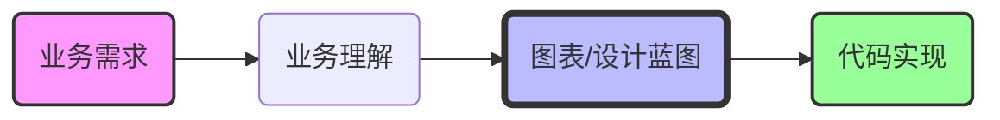
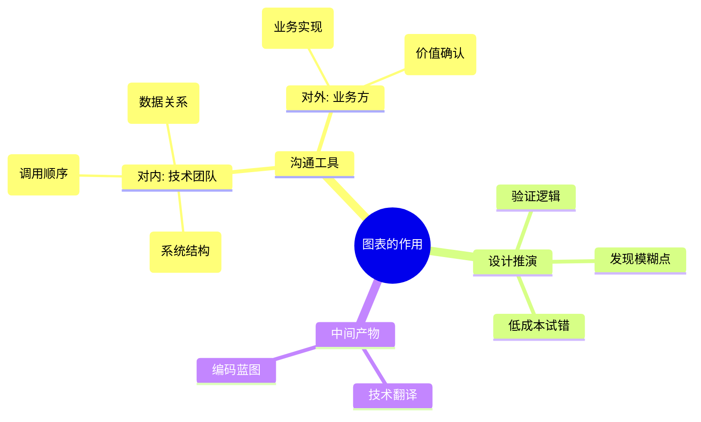
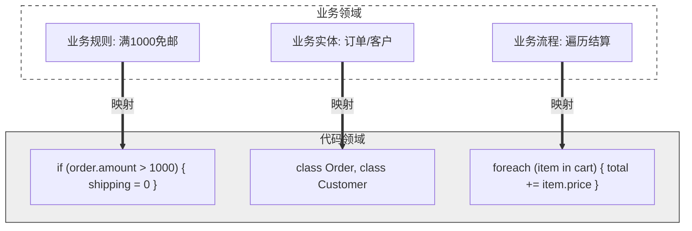

+++
date = '2026-08-31T14:04:58+08:00'
draft = false
title = '代码只是业务的映射'
slug = 'code-is-a-mapping-of-business'
description = '剖析软件开发的本质：软件是业务需求的数字化解决方案，图表是业务理解与技术设计之间的桥梁，代码是这一映射链条的最终实现形式。'
categories = ['架构设计']
tags = ['软件工程', '业务分析', '系统设计']
+++

写了几年代码之后，一个越来越清晰的认知是：我们每天敲下的每一个函数、每一个类，本质上都不是凭空创造，而是在翻译——把业务世界的规则、流程和关系，翻译成机器可以执行的指令。代码从来不是起点，业务才是；代码也不是终点，业务的运转才是。而在这两者之间，各种图表（流程图、时序图、ER 图）扮演着承上启下的桥梁角色：向上把模糊的业务语言转化为可讨论、可评审的设计蓝图，向下为编码提供精确的实现依据。本文围绕“业务需求 → 业务理解 → 图表设计 → 代码实现”这条映射链条展开，聊聊为什么脱离业务理解和设计的代码，往往是无源之水。

**核心论点：软件是现实业务需求的数字化解决方案，代码是其最终实现形式，而各种图表是理解与设计这一映射过程的桥梁。**

---

## 1. 业务驱动一切

### 起点与终点
任何有价值的软件项目都始于一个具体的业务需求或问题。无论是提高效率、开拓市场、降低成本还是优化用户体验，业务目标是软件存在的唯一理由。没有脱离业务的“纯粹技术”软件（除非是纯粹的研究或工具软件，但最终也要服务于某种“业务”——比如研究或开发本身）。

### 需求决定形态
业务的复杂性、规则、流程和数据关系直接决定了软件的功能、模块划分、数据结构和交互逻辑。一个简单的商品展示业务映射出的代码，与一个复杂的金融风控系统映射出的代码，其规模和复杂度天壤之别。

## 2. 理解业务是基石

### 深度挖掘
在动手写代码或画图之前，开发者（分析师、架构师、程序员）必须深入理解业务领域。这包括：
*   **业务目标与愿景**
*   **核心业务流程与规则**（用户旅程、审批流程、计算逻辑、状态变迁）
*   **涉及的角色及其职责**
*   **关键数据实体及其关系**（客户、订单、产品、库存）
*   **业务约束和边界条件**

### 沟通与共识
理解业务不仅是技术人员单方面的事情，更是一个与业务专家（领域专家、产品经理、最终用户）反复沟通、澄清、确认的过程。消除歧义、达成共识是后续一切工作的基础。

## 3. 图表：业务理解的具象化与设计蓝图

### 从抽象到具象
理解了业务之后，如何将复杂的、可能还存在于不同人头脑中的业务概念和流程清晰地、结构化地表达出来？这就是流程图、时序图、用例图、状态图、ER图等可视化工具（如Mermaid、PlantUML、Visio）的价值所在。

### 沟通与设计的工具
*   **对内沟通（技术团队）：** 架构师用组件图描述系统结构，开发人员用时序图描述模块间调用顺序，数据库设计者用ER图描述数据关系。这些图确保团队成员对“我们要构建什么”和“如何构建”有统一的理解。
*   **对外沟通（业务方）：** 流程图可以直观地向业务方展示其流程如何在系统中实现，用例图可以说明系统为用户提供的价值，帮助确认理解是否正确。
*   **设计推演：** 在画图的过程中，本身就是一种设计活动。尝试用图形表达业务逻辑时，常常能发现业务规则中的模糊点、边界情况、潜在的性能瓶颈或设计缺陷。图表是低成本的设计验证工具。

### 映射的中间产物
这些图表本质上**不是技术本身**，而是**对业务需求进行技术性翻译和设计的中间产物**。它们是业务规则、流程在技术层面的第一次“映射”尝试，是后续代码实现的详细蓝图。

## 4. 代码：最终的业务映射实现

### 图表的执行者
代码是依据前面理解业务后绘制的各种设计图表（蓝图）编写出来的。它忠实地（或者说，应该忠实地）将图表中描述的业务逻辑、数据关系、处理流程转化为机器可执行的指令。

### 业务规则的编码化
*   代码中的每一个 `if/else` 分支可能对应着一条业务规则（“如果订单金额大于1000元，则免运费”）；
*   每一个循环可能对应着一个业务流程的重复步骤（“遍历购物车中的每个商品计算总价”）；
*   每一个类或数据结构可能对应着一个业务实体（`Order`, `Customer`）；
*   每一个API调用序列可能精确地对应着时序图中的消息传递。

### 映射的精确性与动态性
代码的质量很大程度上取决于前期业务理解的深度和图表设计的准确性。如果业务理解有偏差或图表设计有缺陷，映射出的代码必然存在问题。同时，代码不仅是静态结构的映射，更是动态行为的映射，它精确地定义了系统如何响应并改变状态。

## 5. 映射链条的完整性与价值

**链条：业务需求 -> 业务理解（沟通）-> 图表（设计/沟通）-> 代码（实现）**

### 图表的关键作用
这个链条中，“图表”环节至关重要。它：
*   将模糊的业务语言转化为相对精确的技术语言。
*   提供了可讨论、可评审、可迭代的设计文档。
*   极大地降低了直接编码的风险（在复杂系统中，不设计直接编码如同盲人摸象）。
*   是知识传递和留存的关键载体（新成员加入、后期维护）。

### 脱离业务的代码是无源之水
忽略业务理解和设计（图表），直接写出的代码往往是：
*   基于片面或错误的理解。
*   结构混乱，难以反映真实的业务关系。
*   可维护性差，业务规则散落各处，牵一发而动全身。
*   难以适应业务变化。

## 结论

“代码只是业务的映射”深刻地揭示了软件开发的本质——**技术服务于业务**。

优秀的软件不是炫技的产物，而是对业务需求精准、高效、灵活的数字映射。而流程图、时序图等图表工具，是这个映射过程中不可或缺的环节。它们是**业务理解与共识的结晶**，是**技术设计的蓝图**，是**沟通的桥梁**。

跳过业务理解和设计（图表），试图直接通过代码“映射”业务，就如同不画图纸就盖大楼，风险极高，结果往往南辕北辙。因此，充分重视业务分析、善用可视化工具进行设计，是产出高质量、符合需求、易于维护的代码（即成功的业务映射）的关键前提。

**没有脱离业务的优雅代码。**
